# 2025's Top 14 Best AI Job Search Tools

Spending three hours filling out the same work history for the fifth time this week feels like digital torture. Most job seekers waste 40+ hours monthly on repetitive applications, manually entering identical information across dozens of portals while their actual skills sit unused [fetch_url:jobhire.ai]. AI job search tools flip this around—they auto-apply to hundreds of positions, optimize your resume for each role, generate custom cover letters, and track everything in one dashboard so you actually have time to prepare for interviews. These platforms use machine learning to match your profile with relevant openings, automatically fill application forms, and even coach you through interviews, cutting job search time by 60% or more.

Whether you're switching careers, applying to tech roles, or just tired of being ghosted after manual applications, these tools handle the grunt work while you focus on landing the right opportunity. Below are 14 platforms ranked by automation quality, ATS compatibility, user experience, and real hiring results reported by job seekers in 2025.

---

## **[JobHire.AI](https://jobhire.ai)**

Complete automation platform that applies to jobs while you sleep and guarantees interview invitations.

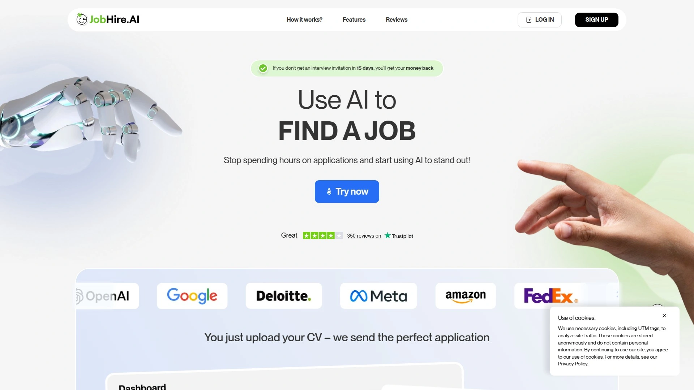

JobHire.AI takes the top spot because it's built for people who are done wasting weekends on applications [fetch_url:jobhire.ai]. You upload your resume, set your preferences, and the AI starts submitting tailored applications across 10+ million job openings automatically [fetch_url:jobhire.ai]. The platform optimizes your resume for each specific role, generates custom cover letters, and handles follow-up emails without you touching a keyboard [fetch_url:jobhire.ai].

What makes JobHire.AI different is the money-back guarantee—if you don't receive an interview invitation within 15 days, you get a full refund [fetch_url:jobhire.ai]. That's confidence in the system actually working. The auto-apply feature saves up to 40 hours weekly compared to manual applications, and over 35,000 job seekers have landed positions through the platform [fetch_url:jobhire.ai].

The dashboard tracks every application, showing you exactly where your resume was sent, which companies viewed it, and response rates in real time [fetch_url:jobhire.ai]. Setup takes about 10 minutes—upload CV, answer preference questions, let the AI handle applications—and most users start seeing interview requests within 7-14 days once recruiters review submissions [fetch_url:jobhire.ai]. Pricing starts at $23/month, with higher tiers offering priority matching and advanced analytics.

JobHire.AI works best for professionals tired of the application hamster wheel who want consistent outreach without daily manual effort [fetch_url:jobhire.ai].

***

## **[Sonara](https://www.sonara.ai)**

**Set-it-and-forget-it automation that applies to jobs continuously until you're hired.**

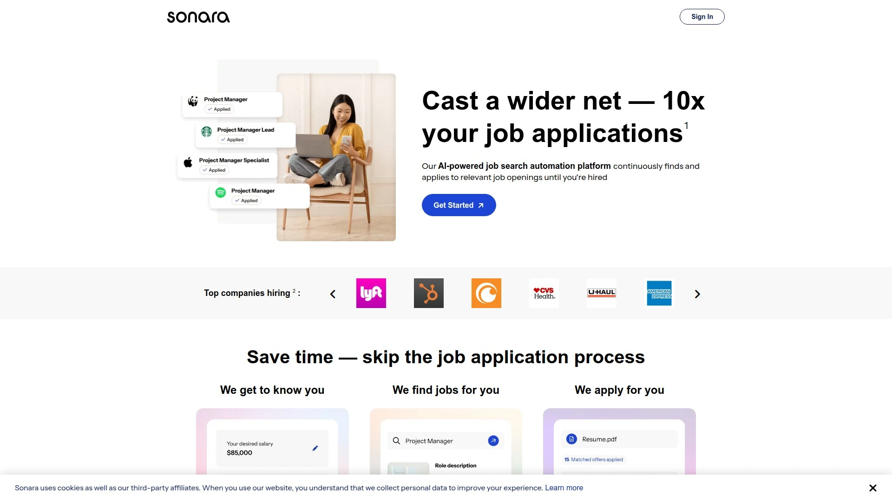

Sonara runs on autopilot [fetch_url:sonara]. The platform scans millions of job openings daily, matches them to your profile, and submits applications automatically without requiring you to review each one [fetch_url:sonara]. You wake up to a list of new roles you've already applied to, matched based on your skills and preferences [fetch_url:sonara].

The AI handles the entire application workflow—it finds jobs, tailors your resume, fills out forms, and tracks submissions [fetch_url:sonara]. Sonara's approach is about casting a wider net; you submit 10x more applications with less effort than one manual application [fetch_url:sonara]. The platform reclaims hours every week by handling the tedious searching and form-filling that normally eats your evenings [fetch_url:sonara].

Users on Reddit compare Sonara favorably to other tools, noting it's priced at $75/year or $23/month. The continuous scanning means you're always in the running for fresh postings, even roles that get filled within hours of being listed. Best for job seekers who want maximum application volume with minimal daily involvement.

***

## **[AIApply](https://aiapply.co)**

**All-in-one suite with resume tailoring, cover letter generation, auto-apply, and live interview coaching.**

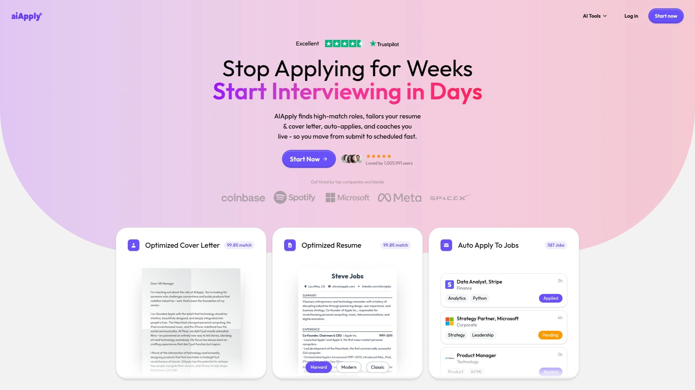

AIApply bundles every stage of the job search into one platform [fetch_url:aiapply]. The AI generates customized resumes and cover letters for each application, dramatically increasing callback rates [fetch_url:aiapply]. Users report hearing back from every job they applied to after using AIApply's tailored documents [fetch_url:aiapply].

Beyond applications, AIApply includes interview prep tools that analyze your speech patterns and provide personalized feedback, plus live interview coaching that gives real-time answers during actual interviews [fetch_url:aiapply]. The auto-apply feature submits thousands of applications automatically, and the resume translator increases international opportunities [fetch_url:aiapply].

One user landed a $180k/year job after prepping with AIApply, while another secured a position at Google using the platform's cover letter generator [fetch_url:aiapply]. The system trains custom AI models on successful resumes and cover letters from candidates who've landed six-figure roles [fetch_url:aiapply].

AIApply offers free versions of most tools so you can test before committing, with premium unlocking unlimited access [fetch_url:aiapply]. The platform works across multiple job boards and matches you with opportunities from integrated listings [fetch_url:aiapply]. Ideal for job seekers who want end-to-end support from application to interview.

***

## **[Jobright](https://jobright.ai)**

**AI copilot that delivers tailored resume optimization and social connection insights for each application.**

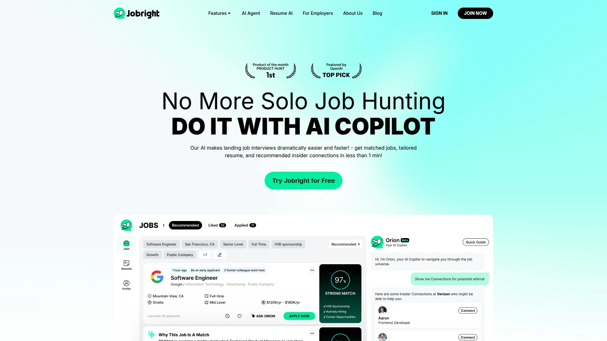

Jobright positions itself as your personal AI job search copilot. The platform provides tailored resumes customized for specific roles, autofill for job applications, and insights into social connections that might help you get noticed. The AI analyzes job descriptions and adjusts your resume to highlight relevant experience and skills.

Jobright's social connection feature is unique—it identifies people in your network who work at companies you're applying to, giving you a warmer introduction path. This bridges the gap between cold applications and genuine referrals.

The platform continuously searches for roles matching your criteria and provides recommendations based on your background and career goals. Jobright is designed for tech job seekers who want quality over quantity, focusing on fit rather than blasting applications everywhere. The interface is clean and user-friendly, making it easy to manage applications and track progress.

***

## **[Careerflow](https://www.careerflow.ai)**

**Career management platform with resume optimization, LinkedIn enhancement, and application tracking.**

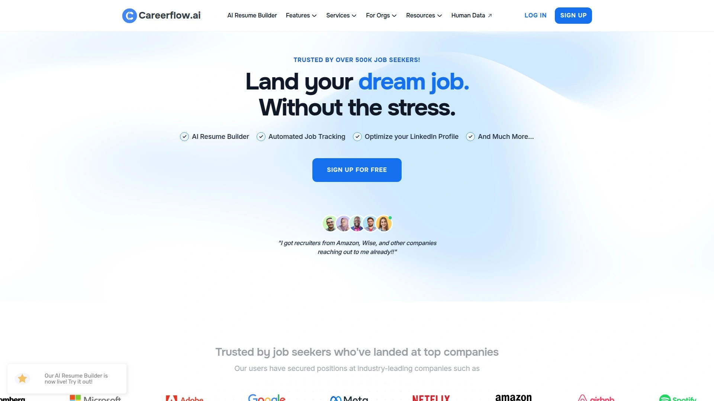

Careerflow takes a holistic approach to career management. The platform combines AI-powered resume optimization with LinkedIn profile enhancement, helping you present a consistent professional brand across channels. You can track applications in one centralized dashboard, seeing where each submission stands and what follow-up actions to take.

The AI analyzes your resume against job descriptions and suggests improvements to increase ATS compatibility. Careerflow also includes LinkedIn tools that optimize your headline, summary, and experience sections to attract recruiter attention.

Users appreciate Careerflow's application tracker, which organizes the chaos of applying to multiple roles simultaneously. The platform provides insights into response rates and helps identify patterns in what's working versus what's not. Careerflow is best for job seekers who want comprehensive career tools beyond just application automation.

***

## **[Simplify](https://simplify.jobs)**

**One-click autofill platform with personalized job recommendations and comprehensive application tracking.**

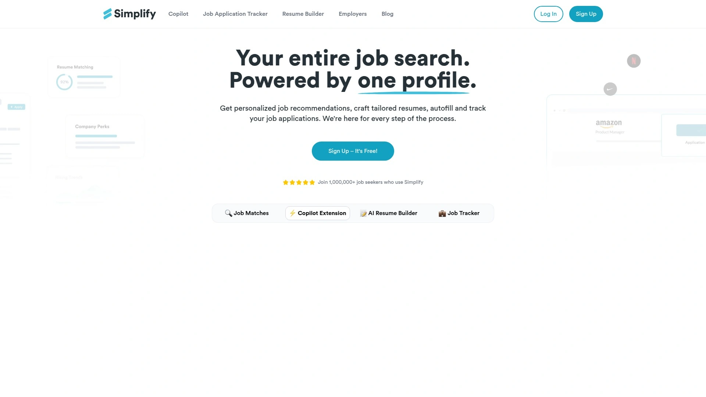

Simplify makes applying to jobs feel effortless. The Chrome extension autofills application forms instantly, eliminating the repetitive data entry that makes job searching miserable. You get personalized job recommendations based on your profile, and the platform tracks all submissions in one organized view.

Simplify's AI answer generator creates responses to common application questions, saving time on those "Why do you want to work here?" prompts. The free version offers substantial functionality, making it accessible for job seekers on tight budgets.

The platform integrates with major job boards and company career pages, working across hundreds of sites seamlessly. Users highlight how Simplify consolidates the entire job search process—discovery, application, and tracking—into a single interface. Best for tech professionals who want speed without sacrificing application quality.

***

## **[LazyApply](https://lazyapply.com)**

**Bulk application Chrome extension that submits to thousands of jobs with minimal setup.**

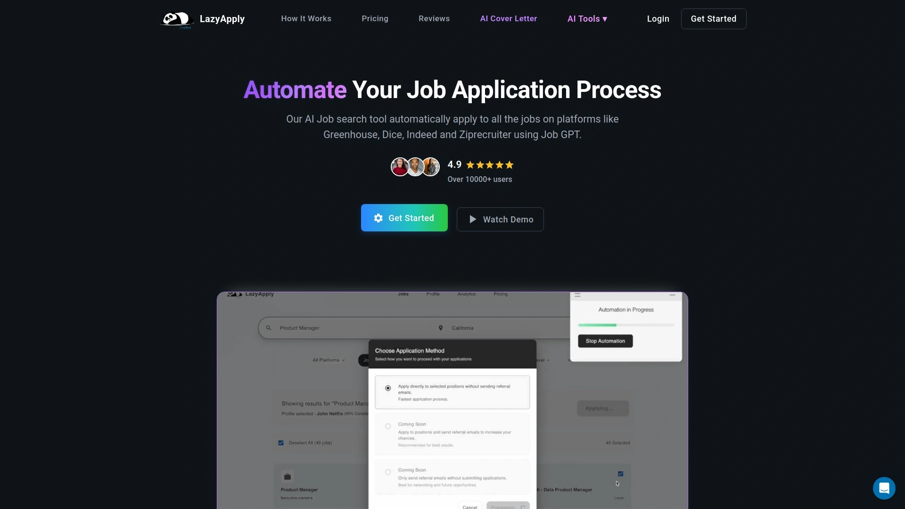

LazyApply is for job seekers who believe job searching is a numbers game. The Chrome extension auto-fills and submits applications to Indeed, LinkedIn, and ZipRecruiter with minimal human intervention. You can apply to hundreds of positions daily while barely lifting a finger.

The platform includes an AI cover letter generator and Resume GPT feature that tailors documents for each submission. LazyApply's approach is quantity-focused—cast the widest possible net and see what sticks.

User reviews are polarized: some call it a massive time saver, others report technical issues and poor customer service. TrustPilot shows 1.9 out of 5 stars with mixed feedback, while the Chrome extension rates 3.7 out of 5. The tool costs around $149/year or $20/month, making it one of the more affordable automation options.

LazyApply works best if you're willing to trade precision for volume and don't mind some applications going to less-than-perfect matches. The platform prioritizes speed over customization.

***

## **[LoopCV](https://www.loopcv.pro)**

**Job search automation with dynamic recruiter outreach emails and CV performance analytics.**

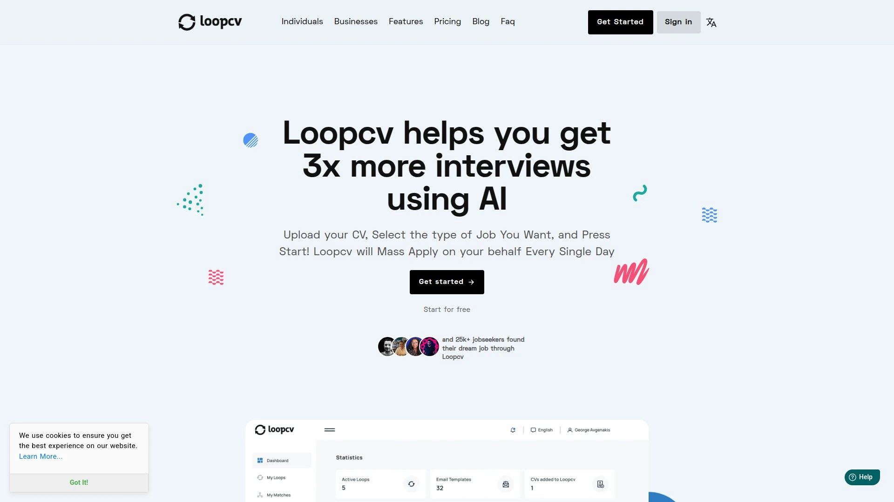

LoopCV automatically finds new job listings matching your preferences and applies on your behalf. If you'd rather review matches first, you can manually approve applications with one click. The platform also identifies recruiter emails at target companies and sends personalized outreach messages.

The dynamic email feature lets you choose from pre-made templates or create custom messages that LoopCV sends to employers on your behalf. This proactive outreach can surface opportunities that never get publicly posted.

LoopCV tracks detailed metrics—how many companies opened your email, response rates, which CV version performed best—giving you data to refine your approach. The A/B testing for different resumes and keywords helps you iterate toward what works.

Some users report issues with LoopCV applying to irrelevant roles or sending emails to incorrect contacts. The platform costs around $10.80/month, making it budget-friendly. Best for job seekers comfortable with high-volume outreach who want metrics to guide improvements.

***

## **[Teal](https://www.tealhq.com)**

**AI-powered career toolkit with resume builder, job tracker, and keyword matching for ATS optimization.**

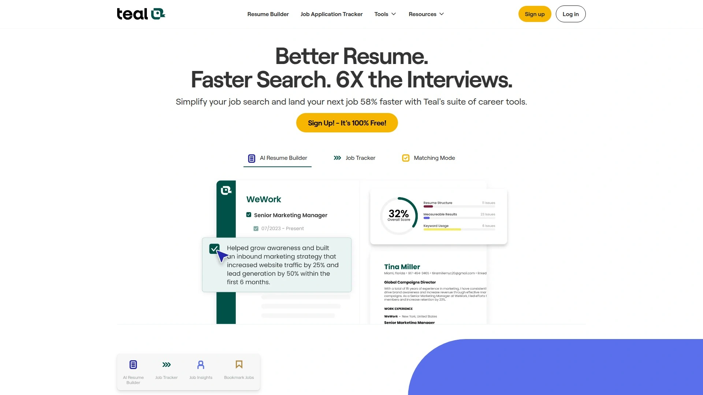

Teal focuses on empowering job seekers with AI tools rather than fully automating the process. The platform's AI resume builder is highly regarded—it creates ATS-friendly resumes tailored to specific job descriptions with keyword matching. You can save jobs from popular boards using the Chrome extension, then spin off customized resume versions for each application.

Teal's job tracker organizes applications in a visual dashboard, showing where each submission stands and what actions to take next. The AI cover letter generator produces tailored letters based on job descriptions, speeding up the customization process.

What separates Teal from pure automation tools is the philosophy: they believe quality applications beat mass submissions. CEO Dave Fano notes that auto-apply can flood systems with unqualified applications, making it harder for qualified candidates to stand out. Teal prioritizes optimizing human input with AI assistance.

The platform offers 90% of features free forever, including the resume builder and tracker. Paid plans start at $9/month for advanced features. Best for job seekers who want control over applications but need AI help to speed things up.

---

## **[JobCopilot](https://jobcopilot.com)**

**Strategic auto-apply system that connects to 300,000+ company career pages for quality applications.**

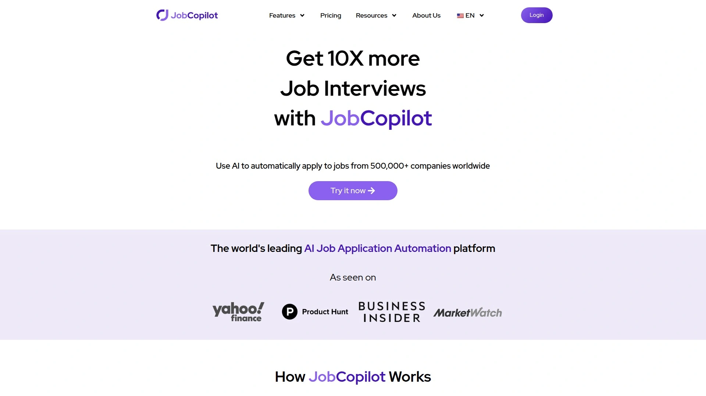

JobCopilot prioritizes quality over sheer volume. The platform connects directly with over 300,000 company career sites, allowing you to apply at the source rather than just through job boards. It targets real openings and submits through official channels, avoiding generic outreach that gets ignored.

The one-click autofill works across virtually any job site, and the AI learns from your past applications to improve future submissions. You can review previous applications, edit responses, and train the system to match your tone and preferences. The dashboard provides full visibility—what's been submitted, where, when, and why certain roles were skipped.

JobCopilot avoids the email-guessing problems that plague some competitors; it sticks to formal application processes rather than blasting messages to random contacts. Over 100,000 users trust JobCopilot to land interviews faster.

The platform adapts over time, becoming more accurate at matching your preferences and communication style. Best for job seekers who want automation without sacrificing application quality.

***

## **[Jobscan](https://www.jobscan.co)**

**ATS resume checker that analyzes and optimizes your resume against specific job descriptions.**

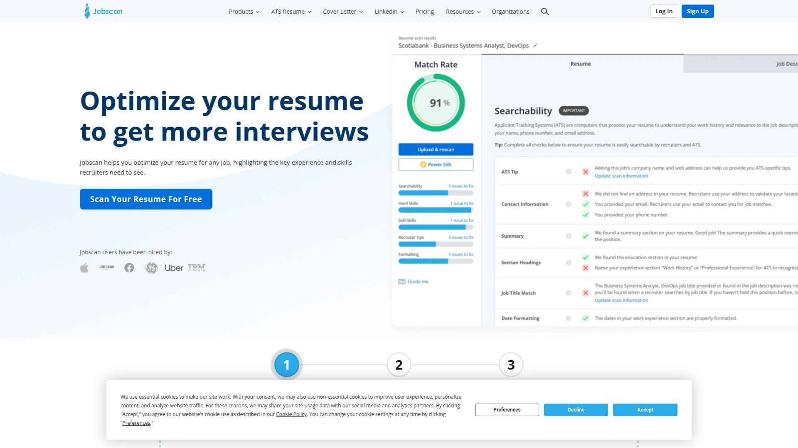

Jobscan specializes in beating applicant tracking systems. The platform's AI analyzes your resume and compares it to job listings, generating a match rate report that shows exactly how to optimize for each role. This helps you identify missing keywords, formatting issues, and content gaps that might cause ATS rejections.

Jobscan's keyword targeting scans job descriptions and suggests must-have terms to improve compatibility. The platform provides real-time feedback as you edit, rating your resume out of 100 based on 23 key factors. This granular analysis helps you understand not just what to change, but why.

The tool is particularly valuable for job seekers applying to large corporations that rely heavily on ATS filtering. Jobscan offers a limited free version with paid plans starting at $49.95/month. The pricing is higher than some competitors, but the depth of ATS optimization justifies it for serious job seekers.

Best for applicants targeting competitive roles at big companies where getting past ATS filters is critical.

***

## **[Scale.jobs](https://scale.jobs)**

**Hybrid platform combining AI automation with human assistant support for personalized applications.**

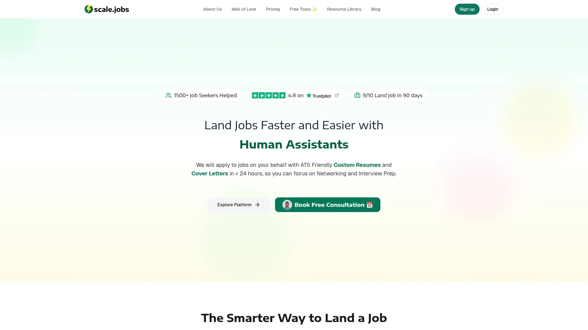

Scale.jobs stands out by blending AI tools with real human assistants. While the platform offers AI-powered resume customization and autofill features, dedicated virtual assistants manually handle submissions to reduce the risk of applications being flagged as bots. They also optimize documents for each job, ensuring a personalized touch.

The human assistants provide 24-hour turnaround for custom resumes and cover letters, real-time WhatsApp updates, and time-stamped proof-of-work screenshots for transparency. This human-in-the-loop approach addresses a major concern with pure automation: applications that feel generic or get filtered out.

Scale.jobs uses a flat-fee pricing model rather than recurring subscriptions. The Basic plan costs $199 for 250 applications managed by one assistant, while the Standard plan is $299 for 500 applications with two assistants. The free tier includes essential tools like an ATS resume checker, application tracker, and daily AI-generated resumes.

The platform also handles visa requirement details through its human assistants, helpful for international job seekers navigating work authorization. Best for professionals who want automation plus human oversight to ensure quality.

***

## **[Rezi](https://www.rezi.ai)**

**ATS-focused resume builder with AI bullet point generation and real-time resume scoring.**

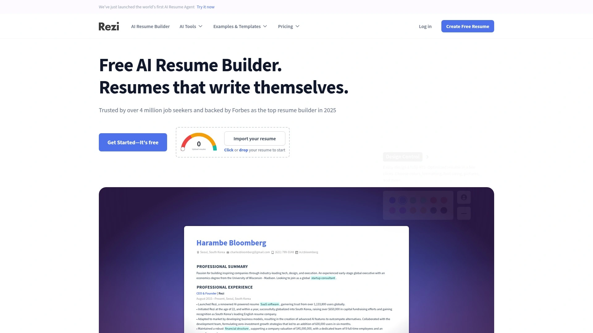

Rezi creates simple, professional, ATS-friendly resumes without unnecessary design frills. The AI generates job-specific bullet points based on your background and target role, making it fast to build tailored resumes. The platform focuses on readability and ATS compatibility over fancy templates.

Key features include AI-generated summaries, keyword targeting that scans job descriptions for must-have terms, and an AI skills explorer that recommends relevant abilities to strengthen your resume. The real-time resume checker analyzes your document as you edit, providing instant feedback.

Rezi scores your resume out of 100 based on 23 factors, giving you a clear measure of effectiveness. The step-by-step interface makes resume building straightforward even for beginners. Over 4 million job seekers trust Rezi for creating resumes that get through ATS filters.

Rezi offers a free plan with limited features and paid plans starting at $16/month. The templates prioritize function over aesthetics, which might disappoint design-focused users but is ideal for corporate applications. Best for job seekers targeting ATS-heavy environments who need solid, compliant resumes.

***

## **[Kickresume](https://www.kickresume.com)**

**ChatGPT-4 powered resume builder with extensive templates and AI writing assistance.**

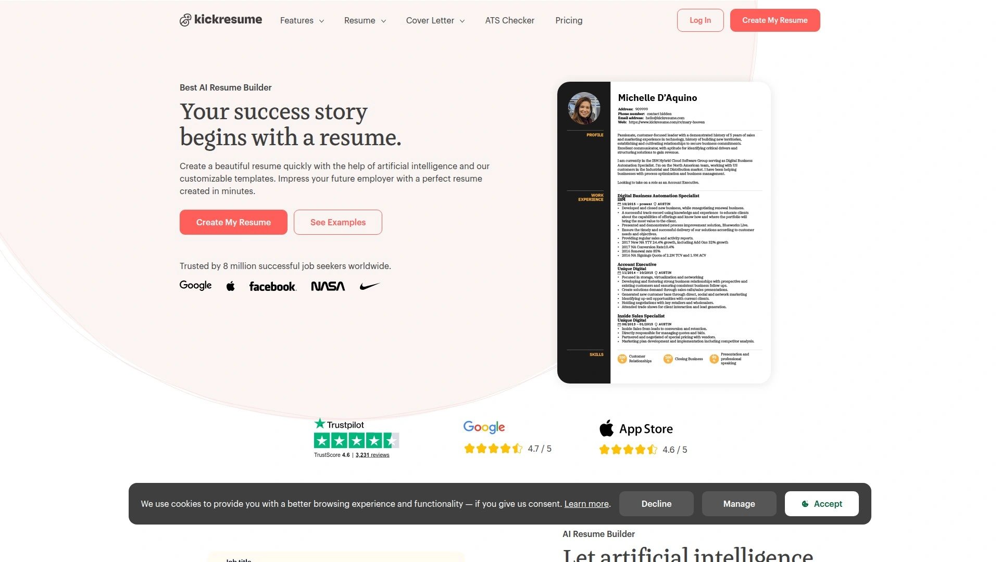

Kickresume uses OpenAI's GPT-4 to generate resume content indistinguishable from human writing. The platform's chatbot asks questions to kickstart your resume, making it easy to begin even with a blank slate. The AI suggests bullet points for job experiences based on your title, providing strong content ideas quickly.

Kickresume offers 44 resume templates, though some focus more on design than content structure. The customization is robust—you can change headings, titles, and formatting extensively. The platform also includes cover letter templates and interview prep tools.

Users can create a satisfactory resume and cover letter in under 20 minutes using Kickresume's AI features. The mobile app works on iOS and Android, letting you build resumes from your phone. Optional proofreading services are available if you want human review.

Kickresume costs around $19/month or $7/month on annual plans, offering fair value for the feature set. The platform has earned recognition as one of the best resume builders overall for ease of use and AI quality. Best for job seekers who want AI-powered writing assistance with attractive template options.

***

## FAQ

**How do AI job search tools avoid getting applications flagged as spam or bot-generated?**

Quality platforms use varied submission timing, customize application data for each role, and integrate with official application systems rather than scraping or guessing. Tools like Scale.jobs employ human assistants to manually submit applications, completely avoiding bot detection. Others like JobCopilot stick to formal application processes and train their AI to match your communication style, making submissions feel authentic. AIApply notes their AI models are advanced enough to bypass detection, and most employers actually value candidates who use AI efficiently to solve problems [fetch_url:aiapply].

**What's the difference between ATS optimization tools and full auto-apply platforms?**

ATS optimization tools like Jobscan and Rezi focus on making your resume pass applicant tracking system filters by analyzing keyword match rates and formatting compliance. They don't submit applications—they improve your documents so human reviewers see them. Auto-apply platforms like Sonara and LazyApply submit applications automatically to hundreds of jobs daily. Some platforms like Simplify and Teal blend both approaches, offering ATS optimization plus autofill features without full automation.

**Are AI job search tools worth paying for if free options exist?**

Free versions typically limit monthly applications, resume generations, or advanced features like interview coaching and human assistant support [fetch_url:aiapply]. If you're casually exploring opportunities, free tiers work fine. But active job seekers applying to dozens of positions weekly benefit from paid plans that offer unlimited applications, priority matching, detailed analytics, and faster turnaround times [fetch_url:jobhire.ai]. Users report landing roles 3x faster with paid automation compared to manual applications, easily justifying costs of $20-50/month during active searches [fetch_url:jobhire.ai].

***

## Conclusion

Finding a job doesn't have to mean sacrificing your weekends to fill out the same forms over and over. These AI platforms automate the tedious parts of job searching—form filling, resume tailoring, cover letter writing—so you can spend time on what actually matters: preparing for interviews and evaluating offers. Some tools prioritize volume with bulk applications, while others focus on precision matching and ATS optimization; the right choice depends on your industry, timeline, and tolerance for automation.

For most job seekers tired of the application grind, **[JobHire.AI](https://jobhire.ai)** delivers the best balance of automation quality and results, with its money-back guarantee and 40-hour weekly time savings making it especially valuable for professionals who want consistent outreach without daily manual effort [fetch_url:jobhire.ai]. Whether you're switching careers or just ready to escape application hell, these tools turn the exhausting job search into a manageable background process [fetch_url:jobhire.ai].

[19](https://skywork.ai/skypage/en/LazyApply-Review-(2025):-I-Tested-The-AI-Job-Bot%E2%80%94Here%E2%80%99s-The-Truth/1972902377842995200)
